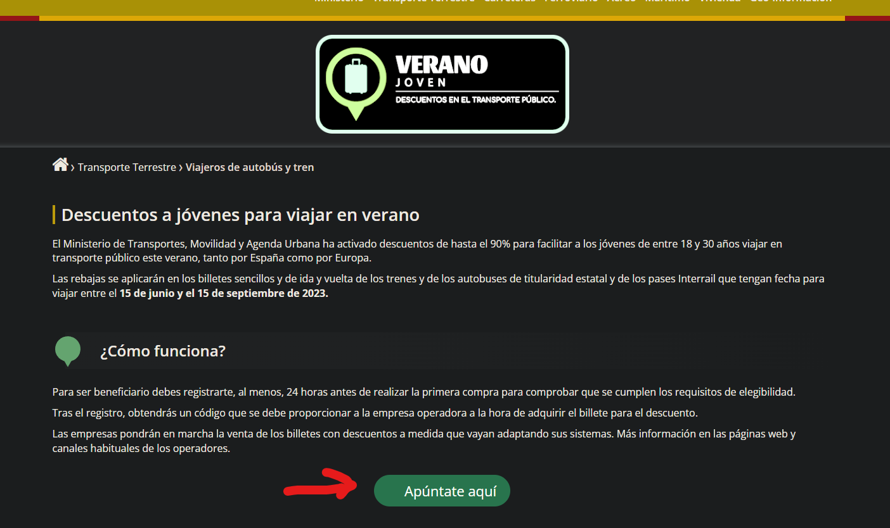
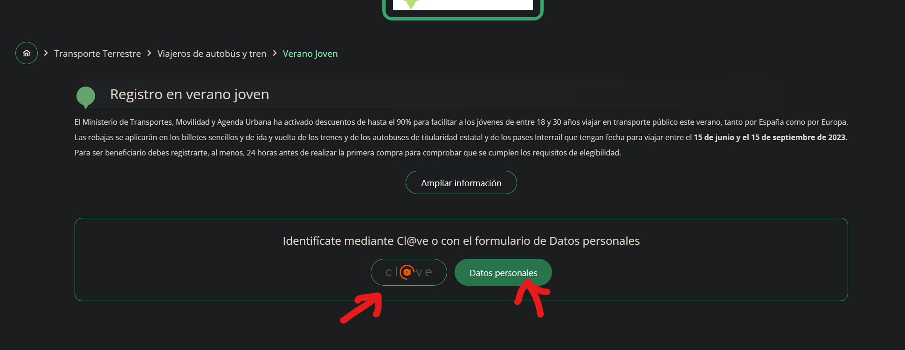
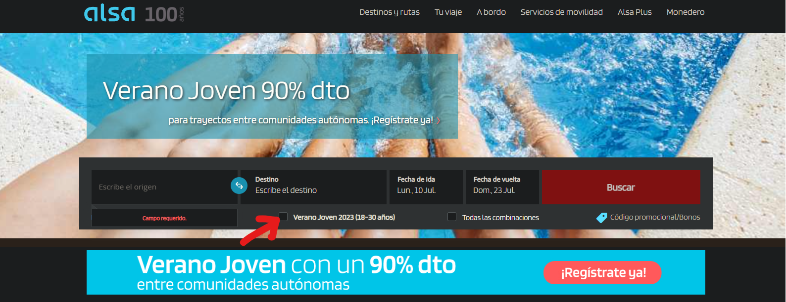
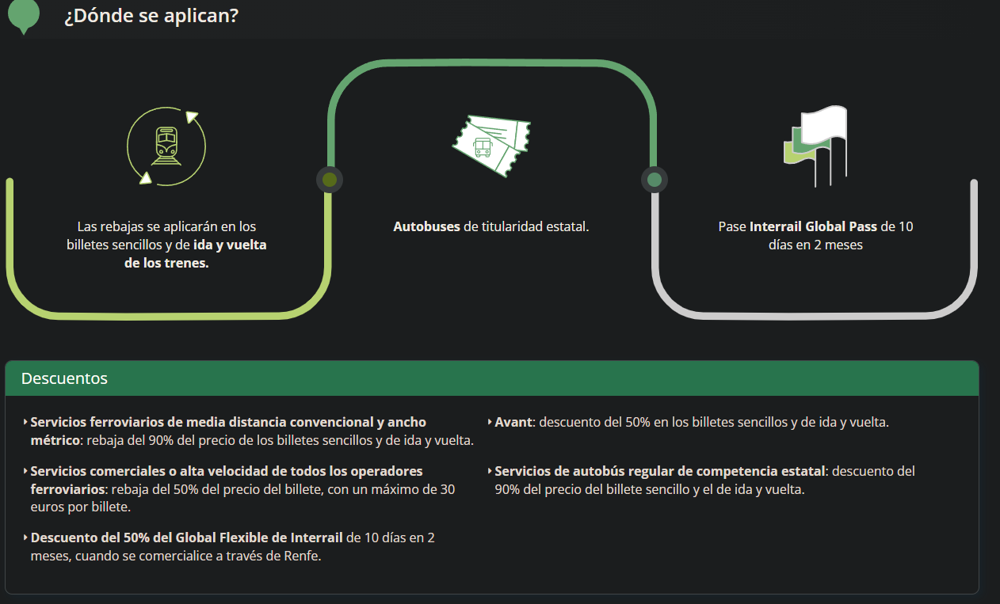

# Cómo acceder a los descuentos de Verano Joven

Para acceder a los beneficios de verano joven podéis acceder a la siguiente URL:

<https://veranojoven.mitma.gob.es/>

**Para registrarse es necesario tener 18 años o más.**

Click en el siguiente enlace que se muestra en la siguiente captura:

Seguidamente necesitarás ingresar tu código PIN o tus datos personales (es más rápido el código pin)

Os darán vuestro código con esta forma **XXXX-XXXXXXXXX-XXXXX**

Deberéis ingresarlo en la siguiente web ( <http://alsa.es> ) para acceder a los descuentos. Luego reservar el billete de la manera habitual.

Los descuentos se aplican como indica en la siguiente captura:

Más info: <https://veranojoven.mitma.gob.es/>